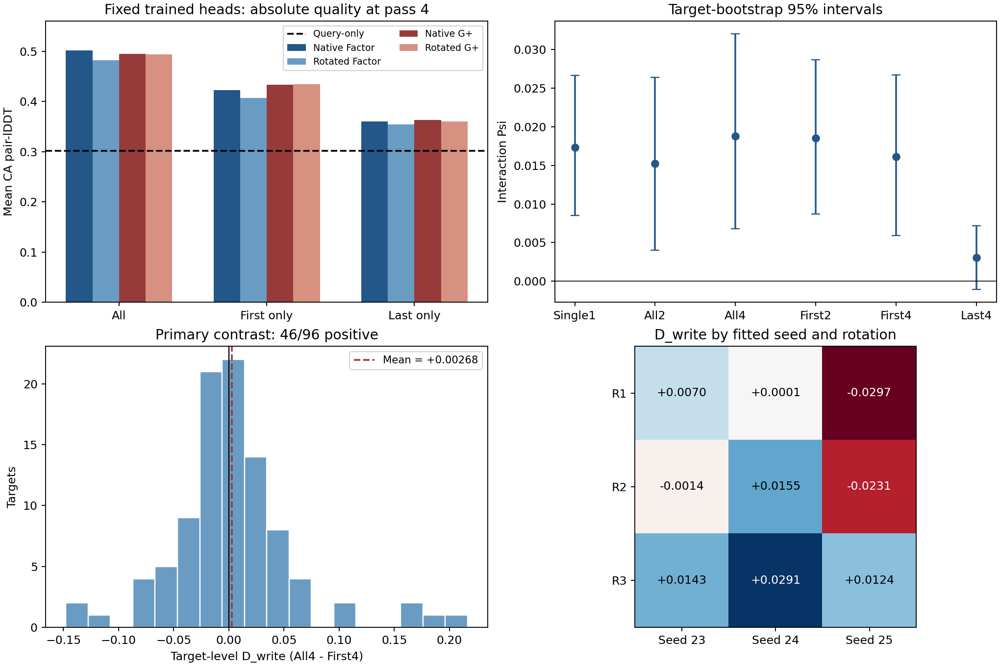

# OpenFold 固定模型注入时序：第一阶段结果与边界

2026-09-26。第一阶段全部完成：**7,008 条四轮预测轨迹、14,112 条去重评分记录，0 失败，零新增训练**。评分于香港时间 01:50 完成。本报告是既有评分的独立汇总，未新增折叠或更换指标。

**主要终点未获支持：All 相对 First-only 没有建立更大的四格交互。**首次写入后继续运行完整四轮，仍能保留正向交互；重复写入对应更高的绝对结构质量。这是两个不同结论。

## 1. 测量对象

固定 OpenFold Train96 / ESM2-35M / Full / 1536 步的24个既有适配器：Factor Native3、Factor Rotated9、G+ Native3、G+ Rotated9。三个训练种子20260923/24/25，三个原稠密旋转20261001/02/03，Confirm96-B96条已观察目标。所有头原本都在All写入、只有末轮保留训练梯度的配方下学习。

本轮不改权重，仅改变完整推理的写入时序：All=(1,1,1,1)、First=(1,0,0,0)、Last=(0,0,0,1)。关闭写入仍执行现场原生OPM与全部主干，不重置recycle状态。Query四轮均不写入。保存同一四轮轨迹的1、2、4轮输出，不把前缀快照当独立目标。

\[
\Psi=(F_N-F_R)-(G_N-G_R),\qquad D_{\rm write}=\Psi_{\rm All,4}-\Psi_{\rm First,4}.
\]

先在每目标内聚合配对种子/旋转，再按96目标汇总；20000次目标配对bootstrap，seed20260926，所有策略共用抽样。区间条件于固定模型与面板；不能当跨重新训练或家族独立总体区间。

## 2. 四格绝对值与主要终点

下表均为Cα pair-lDDT，0–1尺度；Rotated为九个已训练旋转模型的平均。

|四轮推理时序|Factor Native|Factor Rotated|G+ Native|G+ Rotated|Query|交互Ψ及95%区间|
|---|---:|---:|---:|---:|---:|---|
|All|0.50190|0.48209|0.49534|0.49435|0.30191|+0.01882 [0.00683, 0.03204]|
|First-only|0.42282|0.40727|0.43375|0.43434|0.30191|+0.01614 [0.00591, 0.02675]|
|Last-only|0.35991|0.35418|0.36268|0.36001|0.30191|+0.00306 [−0.00106, 0.00722]|

**预设主要比较：D_write=+0.002680，95% CI [−0.008412, +0.014357]。**逐目标46/96为正、50/96为负，中位数−0.000869；没有建立重复写入增大交互，也没有证明All和First交互等效。

Factor Native的All−First均值为+0.07908；另外三臂对应+0.07482、+0.06159、+0.06001。这些描述性差值说明改变时序明显影响绝对质量，不能只用Ψ概括部署效果。First四臂相对Query的均值仍为+0.10536至+0.13243，Last为+0.05227至+0.06077；稀疏写入并非完全退回Query。

All的原交互点估计+0.018819与历史四格结果一致；本报告采用此次锁定的bootstrap seed，区间端点与历史报告可以略有不同，不将其误写成模型漂移。

## 3. 种子、旋转与逐目标分布

D_write的三个种子边际：+0.00664、+0.01488、−0.01348；三个旋转边际：−0.00754、−0.00300、+0.01858。它既不是所有种子同向，也不是所有旋转同向。

|D_write|seed20260923|seed20260924|seed20260925|
|---|---:|---:|---:|
|R20261001|+0.00698|+0.00006|−0.02967|
|R20261002|−0.00136|+0.01550|−0.02315|
|R20261003|+0.01429|+0.02907|+0.01239|

相比之下，First-only自身Ψ在三个种子和三个旋转边际均正，但逐目标仅57/96为正。这支持固定实例范围内的平均交互，不能称每条蛋白都获益。完整目标向量、四分位数和全部边际见原始analysis.json及独立审计。

[矢量PDF](phase1_summary.pdf)。图中区间为目标bootstrap；九格是固定拟合实例的描述性边际，不是九个独立面板。

## 4. 预设次要比较与深度曲线

|pair-lDDT直接比较|均值|95% CI|说明|
|---|---:|---|---|
|All4−Last4交互|+0.01576|[+0.00302, +0.02930]|次要；TM-score区间跨零|
|First4−Last4交互|+0.01308|[+0.00212, +0.02450]|次要；三指标同向且各自区间正|
|First4−Single1交互|−0.00119|[−0.00891, +0.00636]|没有建立单次写入后传播增大交互|
|All4−Single1交互|+0.00149|[−0.00906, +0.01267]|没有建立整体深度交互增幅|

这些是预设但未统一多重校正的次要区间，不能替代未通过的主要量。First与Last都只直接写入一次，但状态、写入时机及其后的传播不同，不能由二者差异唯一识别反馈模块。

|保存的前缀/终点|Factor Native|Factor Rotated|G+ Native|G+ Rotated|Query|Ψ|
|---|---:|---:|---:|---:|---:|---:|
|Single1（All/First共同首轮）|0.37967|0.36027|0.39525|0.39318|0.26321|+0.01733|
|All2|0.44757|0.43015|0.44959|0.44739|0.28330|+0.01523|
|First2|0.41009|0.39133|0.42168|0.42146|0.28330|+0.01854|
|All4|0.50190|0.48209|0.49534|0.49435|0.30191|+0.01882|
|First4|0.42282|0.40727|0.43375|0.43434|0.30191|+0.01614|
|Last4|0.35991|0.35418|0.36268|0.36001|0.30191|+0.00306|

首次结构输出已出现交互，并在First4保留。可以说：在这些按All训练的固定头上，观察到交互不要求在后续每轮重复写入。不能说训练中的多轮状态无关，或First-only从头训练必然获得同样结果。

## 5. 三种评分没有改变主要结论

|D_write|均值|95% CI|正向目标|
|---|---:|---|---:|
|Cα pair-lDDT|+0.002680|[−0.008412, +0.014357]|46/96|
|逐残基Cα-lDDT|+0.002218|[−0.008332, +0.013310]|48/96|
|TM-score|−0.004119|[−0.019067, +0.011385]|45/96|

TM-score点估计为负，不能写成所有指标支持All额外交互增益。三种评分来自相同结构，并非三份独立验证。

## 6. 验收、执行与下一阶段边界

独立脚本从14112条逐目标评分重新构造261项四格、行内效应、交互、直接差及种子/旋转汇总，包含20000次相同抽样区间；最大绝对偏差3.33×10⁻¹⁶。保存评分中的独立pair-lDDT实现交叉核对最大差1.274×10⁻¹⁴。该审计没有重新读取全部CIF评分，不能冒称第二次完整CIF重评。预测与评分文件SHA、执行锁和完整终态收据一致。

最初评分任务因debug队列30分钟限时未完成；独立IO修订仅并行文件SHA校验并复用既有评分缓存，未改指标/统计/目标。原记录保留。两种时序的共同首轮、Last前三轮与Query的逐位前缀身份由正式评分入口统一检查。

第二阶段完整72组协议在读取本次科学汇总前已独立锁定，HPC3公共校准652881、第一波36组652882已提交。第二阶段让各策略从零学习，并统一保留原生可微跨轮路径，回答不同问题；不是给第一阶段阴性主要结果补救。第一波36组包括全部Native与R1，后36只补R2/R3。当前只调试HPC2第二波入口，不根据本报告选择旋转、学习率、目标或删除臂。

本轮最合适的结论是：**既有适配器的绝对预测质量依赖注入时序；参数化×旋转交互在仅首次写入时仍可观察，未建立重复写入进一步放大该交互。**不据此宣称唯一反馈机制，也不将部署失配结果当作三策略各自训练后的性能排序。

来源：[独立审计](independent_audit.json)、[审计与制图脚本](audit_summary.py)、[完整原汇总](../analysis/analysis.json)、[逐目标三指标](../analysis/metric_records.json)、[完成收据](../analysis/complete.json)。
